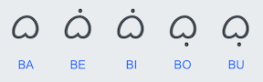
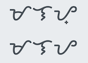

_Suyat Translator_ is an open-source Javascript library for translating (transliterating) Philippine text into their corresponding indigenous scripts. The following scripts, or writing systems, are supported:
* [Baybayin](https://en.wikipedia.org/wiki/Baybayin) (Tagalog)
* [Hanunó'o](https://en.wikipedia.org/wiki/Hanunuo_script) Mangyan
* [Buhid](https://en.wikipedia.org/wiki/Buhid_script)
* [Tagbanwa](https://en.wikipedia.org/wiki/Tagbanwa_script)

**Key Features**

1. supports both dynamic (as you type each letter) and bulk text translation modes
2. uses [Google Noto Fonts](https://www.google.com/get/noto/) for wide compatiblity
   * works out-of-the-box on iPhone/iPad and Android devices
   * requires downloading the fonts on Windows, Mac & Linux

## Demo

> Suyat Translator&nbsp;&nbsp;&nbsp;[https://www.isawika.com/translator](https://www.isawika.com/translator)

## Background

Suyat is an [_abugida_](https://en.wikipedia.org/wiki/Abugida) (aka _"alphasyllabary"_), a writing system in which consonant-vowel sequences are written as a unit rather than 2 separate symbols.

The rules are simple. Put a _kudlit_ (diacritical mark) above the base consonant symbol to represent a trailing vowel 'e' or 'i', or below to represent 'o' or 'u'. Don't put a _kudlit_ when the trailing vowel is 'a'. Here is an example in Baybayin.

What if syllable ends with a consonant? Traditionally you would leave the base symbol unmarked. For example:

 which can be read as "malay" or "malaya"

To eliminate this ambiguity, a new convention was adopted-- add a _virama_ (ending diacritical mark) to the base consonant symbol.

 **Top:** "malay", **Bottom:** "malaya"

The Hanunó'o script follows the same set of rules. The Buhid and Tagbanwa scripts did not adopt the virama convention, hence making them more challenging to read.

## Using the suyat.js Library

1. Include the library in your code

    >``

2. Instantiate the Suyat class

    >var myScript = new Suyat('hanunoo'); &nbsp;&nbsp;// or 'baybayin', 'buhid', 'tagbanwa'

3. To translate a text block

    >var output = translateBulk(inputText); 
    >$(target).html(output);`

4. To translate letters as you type, call the _computeChangeOnAdd()_ or  _computeChangeOnDelete()_ function. Look at **editor.js** for an example.

## How Dynamic Translation Works

The library generates a translation by representing each _suyat_ symbol (glyph) as a sequence of 1 or 2 Unicode characters: the base character, optionally followed by a [combining diatritical mark](https://en.wikipedia.org/wiki/Combining_character).

For example, the Hanunó'o syllable "mi"  is represented as the Unicode sequence **U**+172B, **U**+1732.

As the user types each input letter (or delete), the functions _computeChangeOnAdd()_ or  _computeChangeOnDelete()_ determines what changes to make in the output buffer, returning this information in the form of an "edit command". The edit command specifies:

- how many Unicode characters to delete from the end of the buffer
- the new sequence of Unicode characters to add

Your application should then modify the output buffer accordingly. 

The rules for formulating the edit commands are based on how you would actually write the script. Here are the rules for [Modified Baybayin](https://blog.kabuay.com/tutorials/modified/). These rules are implemented in the above 2 compute functions.
